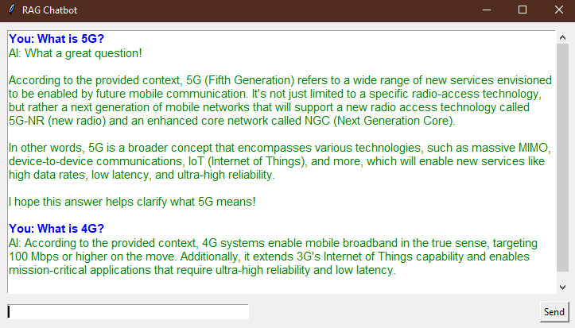

# Retrieval Augmented Generation (RAG) for telecommunication

## Introduction

Retrieval Augmented Generation (RAG) is needed to enhance Large Language Models (LLMs) by providing them with access to external, up-to-date knowledge bases, reducing hallucinations, and enabling more accurate and contextualized responses. RAG overcomes the limitations of LLMs, which rely solely on their pre-trained data and can struggle with factual accuracy and contextually relevant answers.

## Depolyment

This prototype depolyed on Windows, and it is written in Python.

### Requirements:

    Transformers
    Ollama
    Python 3.8
    Torch 2.0.1

### Set up

1. **Install all dependencies**
   ```
   pip install -r requirements
   ```
2. **Download the language model, I use llama3**
   ```
   Ollama pull <model-name>
   ```
3. **Add related pdf files (e.g. textbooks) in directory \content.**
4. **Execute the rag.ipynb**
5. **Ask questions to your own rag**

### Example

